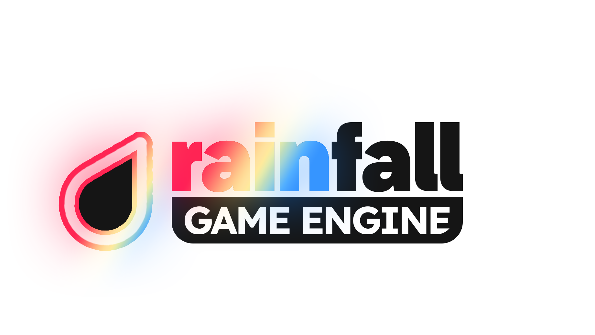

# RAINFALL ENGINE

Rainfall Game Engine is a custom 3D game engine and visual editor built from scratch in C++ and OpenGL. It was developed with a focus on modern software architecture (Entity-Component-System), physically based rendering (PBR), and providing a user-friendly visual editor.

## Key Features
* **Entity-Component-System (ECS):** Flexible architecture for managing game objects and logic.
* **Visual Editor:** A comprehensive scene editor powered by Dear ImGui with dockspace support, a scene graph, and a real-time entity inspector.
* **Advanced Rendering:** Deferred rendering pipeline with PBR (Physically Based Rendering) and shadow mapping.
* **HTML/CSS User Interfaces:** Integrated RmlUi for creating in-game HUDs using web standards.
* **Serialization:** Projects (`.rainp`) and Scenes (`.rain`) are easily serialized and loaded using YAML.
* **Physics:** Basic collision detection (Bounding Spheres).

---

## Getting Started

### Prerequisites
To build the engine, you will need a C++20 compatible compiler and [CMake / Visual Studio]. The engine relies on the following libraries (included/linked in the project):
* OpenGL & GLFW & GLM
* Dear ImGui
* Assimp (for 3D model loading)
* yaml-cpp (for serialization)
* RmlUi (for in-game UI)

### Building the Project
1. Clone the repository: `git clone https://github.com/Rohlicek128/rainfall_engine.git`
2. Open the project in your IDE and build the solution.

---

## Project Setup & Integration

If you want to build a game using the RainFall Engine without compiling the entire source code, you can use the pre-compiled `engine.lib` from the [GitHub Releases](https://github.com/Rohlicek128/rainfall_engine/releases).

### 1. Recommended Directory Structure
To ensure the engine finds your assets and libraries correctly, organize your project as follows:

```text
GameProject/
├── assets/              # Game models, textures, shaders
├── scenes/              # .rain scene files
├── engine/              # Required engine runtime files (from release)
├── include/
│   └── rainfall/        # Engine headers (from release)
├── lib/                 # Pre-compiled libraries
│   ├── rainfall/        # Contains engine.lib
│   ├── glfw/
│   ├── assimp/
│   └── ... (other dependencies)
├── src/                 # Your C++ source code
└── CMakeLists.txt
```
> [!NOTE]
> The paths for `assets/` and `scenes/` are defaults. You can change them in your code via `current_project->assets_dir` and `current_project->scenes_dir`.

### 2. CMake Configuration
Your `CMakeLists.txt` must properly link the engine and its dependencies. It also needs to copy the runtime folders to the build directory so the executable can find them.

```cmake
# Add glad.c to your sources
list(APPEND SRCS "${CMAKE_CURRENT_SOURCE_DIR}/lib/glad/glad.c")

# Set up include directories
target_include_directories(${PROJECT_NAME}
    PUBLIC
    "${CMAKE_CURRENT_SOURCE_DIR}/include/rainfall"
    "${CMAKE_CURRENT_SOURCE_DIR}/lib/glfw"
    "${CMAKE_CURRENT_SOURCE_DIR}/lib/glad"
    "${CMAKE_CURRENT_SOURCE_DIR}/lib/stb"
    "${CMAKE_CURRENT_SOURCE_DIR}/lib/RmlUi"
    "${CMAKE_CURRENT_SOURCE_DIR}/lib/freetype"
    "${CMAKE_CURRENT_SOURCE_DIR}/lib/assimp"
)

# Link the pre-compiled engine and third-party libraries
target_link_libraries(${PROJECT_NAME} PRIVATE
    "${CMAKE_CURRENT_SOURCE_DIR}/lib/rainfall/engine.lib"
    "${CMAKE_CURRENT_SOURCE_DIR}/lib/glfw/glfw3.lib"
    "${CMAKE_CURRENT_SOURCE_DIR}/lib/yaml-cpp/yaml-cppd.lib"
    "${CMAKE_CURRENT_SOURCE_DIR}/lib/assimp/assimp-vc143-mtd.lib"
    "${CMAKE_CURRENT_SOURCE_DIR}/lib/RmlUi/rmlui_debugger.lib"
    "${CMAKE_CURRENT_SOURCE_DIR}/lib/RmlUi/rmlui.lib"
    "${CMAKE_CURRENT_SOURCE_DIR}/lib/freetype/freetyped.lib"
    "opengl32"
    "dwmapi"
)

# IMPORTANT: Copy assets, scenes, and engine data to the output directory
add_custom_command(
    TARGET ${PROJECT_NAME} POST_BUILD
    # Copy Game Assets
    COMMAND ${CMAKE_COMMAND} -E copy_directory
        "${CMAKE_SOURCE_DIR}/assets"
        "$<TARGET_FILE_DIR:${PROJECT_NAME}>/assets"

    # Copy Game Scenes
    COMMAND ${CMAKE_COMMAND} -E copy_directory
        "${CMAKE_SOURCE_DIR}/scenes"
        "$<TARGET_FILE_DIR:${PROJECT_NAME}>/scenes"

    # Copy Engine internal shaders/data
    COMMAND ${CMAKE_COMMAND} -E copy_directory
        "${CMAKE_SOURCE_DIR}/engine"
        "$<TARGET_FILE_DIR:${PROJECT_NAME}>/engine"

    # Copy necessary DLLs or engine runtime from lib
    COMMAND ${CMAKE_COMMAND} -E copy_directory
        "${CMAKE_SOURCE_DIR}/lib/engine"
        "$<TARGET_FILE_DIR:${PROJECT_NAME}>/"
)
```


## User Manual: How to Use the Engine

RainFall Engine consists of two main parts: the **Visual Editor** and the **C++ API** for writing game logic.

### 1. Using the Visual Editor
The editor acts as a visual interface for YAML data serialization. It allows you to build levels without hardcoding entity positions.
* **Projects & Scenes:** Create a new project (`.rainp`). Inside the project, you can create and manage multiple scenes (`.rain`).
* **Scene Graph:** Use the hierarchy panel to create Entities. Entities support parent-child relationships (e.g., attaching a camera to a player).
* **Inspector:** Click on any entity to view it in the Inspector. Here, you can dynamically add components (e.g., `MeshComponent`, `LightComponent`, `SphereCollider`) and tweak their values (transformations, colors, light intensity) in real-time.

### 2. Writing Game Logic (C++)
To create a game, you need to inherit from the `engine::Application` class. This is where you define what happens when your game starts and updates.

#### Creating your Application
```cpp
#include <engine/core/Application.h>

class ExampleGame : public engine::Application {
public:
    void on_start() override;
    void on_update(const float delta_time) override;
};
```

#### Setting up a Scene Programmatically
While you can build scenes in the editor, you can also spawn entities and add components via C++ code. Here is an example of initializing a scene and adding a player and a light in the `on_start()` method:

```cpp
void ExampleGame::on_start() {
    // 1. Setup Project Paths
    // Leave project_dir empty for distribution builds so it uses relative paths!
    current_project->project_dir = ""; 

    // 2. Load or Create a Scene
    Scene* scene = scene_manager->create_scene("MainScene", true);

    // 3. Create an Entity and add Components
    Entity* player = scene->create_entity("Player");
    
    // Add visual representation
    player->add_component<MeshComponent>(0, GL_TRIANGLES, resource_manager->get_mesh_manager());
    Texture* tex = resource_manager->load_texture("assets/textures/character.jpg", "jpg");
    player->add_component<TextureComponent>(tex);
    
    // Add physics and custom logic
    player->add_component<engine::physics::SphereCollider>();
    player->add_component<PlayerScript>(); // Your custom script

    // 4. Add Lighting
    Entity* light = scene->create_entity("PointLight");
    light->transform->position = glm::vec3(3.0f, 2.0f, 2.0f);
    light->add_component<LightComponent>(lights::LIGHT_TYPE::POINT, glm::vec3(1.0f, 1.0f, 0.8f));
    light->get_component<LightComponent>()->intensity = 5.0f;
}
```

### 3. Handling Input and Updates
Put your continuous game logic inside the `on_update` method or inside custom Component Scripts.

```cpp
void ExampleGame::on_update(const float delta_time) {
    // Example of handling keyboard input
    if (input_manager->get_key_down(GLFW_KEY_SPACE)) {
        // Jump logic here
    }
}
```

### 4. Path Management

* **Editor Mode**: When using the editor, `project_dir` contains an absolute path (e.g., `C:\Projects\Game\`) so the editor knows exactly where to save your `.rain` files.

* **Build/Release** Mode: Set `project_dir = ""` (an empty string). The engine will automatically switch to relative paths, ensuring the game runs smoothly on any machine as long as the `assets/` and `scenes/` folders are next to the executable.


## Acknowledgments & Credits

The development of this engine was heavily inspired by and built upon several amazing resources and open-source projects:

* LearnOpenGL by Joey de Vries - The primary educational resource used for implementing the graphics pipeline, deferred rendering, and PBR.
* Dear ImGui by Omar Cornut - Used for the visual editor interface.
* RmlUi - Used for rendering the in-game HUD.
* GLFW, GLM, Assimp, yaml-cpp - Core dependencies that make this project possible.